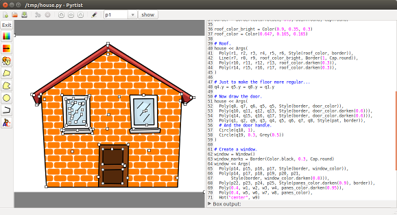

=======
Pyrtist
=======

Pyrtist is a library and IDE which enables **drawing using Python scripts**.

Pyrtist is a vector graphics editor. The main difference with respect to
traditional vector graphics editors like `Inkscape <https://inkscape.org/>`_ is
that the input for drawing comes from a Python script.

The Pyrtist window is subdivided in two halves:

* The **script view** allows to write and adjust the Python script which draws
  the graphics,

* The **picture view** shows the graphical output produced by the script and
  allows to interact with the picture and adjust it, by moving some reference
  points (with the mouse for example), which the Python script sees as regular
  variables.

   The cartoon house example opened in the Pyrtist GUI.

The two views allow you to create pictures that can exploit the scripting
capabilities of Python while still allowing you to naturally interact with the
graphics. Your drawings can be saved to disk as ordinary Python scripts.
You can execute them on their own, outside the Pyrtist user interface,
or you can re-open them with Pyrtist if you need to change them.

Your scripts can exploit the full power of Python and can be as smart as you
want them to be. If you are a programmer, you can then use the tools you are
familiar with. You can track different versions of your drawings using
`git <https://git-scm.com/>`_. You can use Makefiles to automatically rebuild a
large collection of Pyrtist drawings, which all import the same module defining
color and style. Need a different color scheme or line width scheme for all
your pictures? Just change one file and type ``make``. They will all be
generated automatically for you. Importantly, you can easily reuse old
drawings. They are text and as such you can easily copy and paste them. You can
create modules containing them and you can couple them with the thousands
Python libraries out there.

======
Status
======

This software is under development. It can be used already, despite not being
feature complete. The drawing API is not fully stable, yet. Any feedback and
contributions are welcome.
